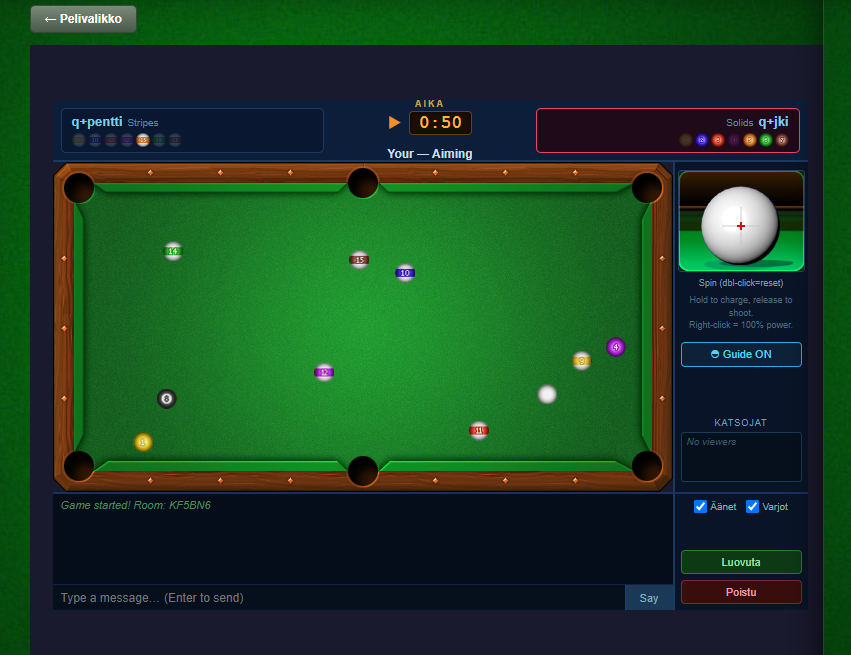
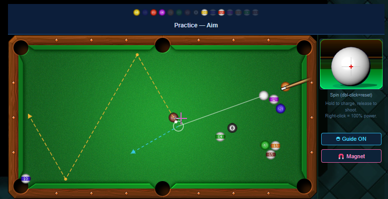

playforia
=========

Faithful web ports of the original Playforia (Aapeli) games. Currently: **Pool & Snooker**
(8-ball, 9-ball, rotation, count, free practice, snooker) with a physics engine ported from
the original Java client, an aim-assist "cheat" system, a token/badge progression layer, and
WebSocket multiplayer (lobby, challenges, deterministic-lockstep play, spectating).

Game play images:

Test the current development:
https://jooansk.github.io/playforia/